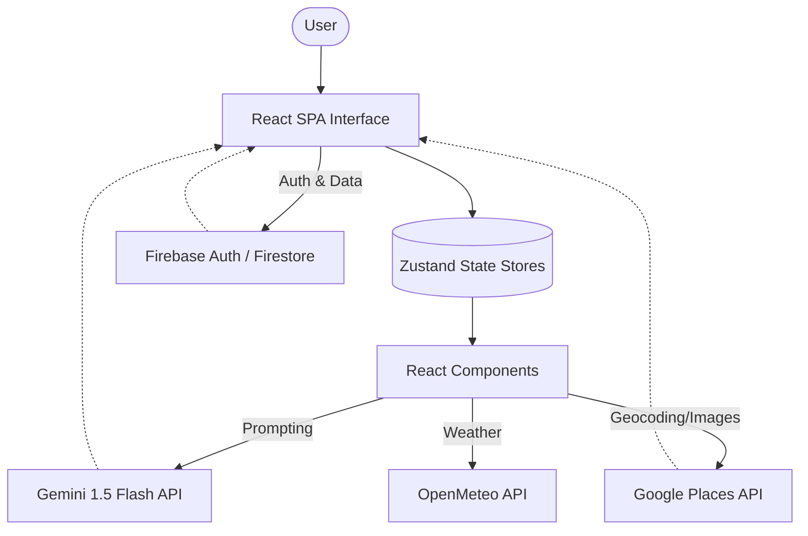

# WanderIQ 🏖️

WanderIQ is an AI-powered travel planning and experience engine that helps users discover destinations, assemble multi-day trip itineraries, and apply personal constraints in real-time. Built specifically for the HACK2SKILL PromptWars In-Person hackathon.

## 🌟 Key Features
- **AI Destination Discovery:** Get tailored destination recommendations based on mood and preferences.
- **Dynamic Itinerary Builder:** Drag-and-drop daily schedule planner.
- **Real-time Constraints:** Automated budget, transit, and accessibility violation warnings.
- **Gemini AI Integration:** Chat with a travel assistant that understands your current itinerary context.
- **Collaborative Planning:** Share and co-edit itineraries with friends.

## 🏗️ Architecture Data Flow



## 🛠️ Tech Stack

| Layer | Technology | Purpose |
|-------|------------|---------|
| **Frontend Framework** | React 18 & TypeScript | Core UI and business logic |
| **Build Tool** | Vite | Fast module bundling and HMR |
| **State Management** | Zustand | Global client state (Auth, Itinerary, Prefs) |
| **Routing** | React Router DOM | SPA client-side routing |
| **Styling** | Vanilla CSS | Custom design system & variables |
| **Drag & Drop** | dnd-kit | Accessible itinerary sorting |
| **Testing** | Vitest & Playwright | Unit and E2E coverage |
| **Backend & Auth** | Firebase | User authentication & cloud database |
| **AI Integration** | Google Cloud (Gemini) | AI context parsing & recommendations |

## 🚀 Environment Setup

Create a `.env` file in the root directory with the following variables:

```env
# Google Maps & Places
VITE_MAPS_API_KEY=your_google_maps_api_key_here

# Firebase Configuration
VITE_FIREBASE_API_KEY=your_firebase_api_key
VITE_FIREBASE_AUTH_DOMAIN=your_project.firebaseapp.com
VITE_FIREBASE_PROJECT_ID=your_project_id
VITE_FIREBASE_STORAGE_BUCKET=your_project.appspot.com
VITE_FIREBASE_MESSAGING_SENDER_ID=your_sender_id
VITE_FIREBASE_APP_ID=your_app_id
```

### Running Locally
1. `npm install`
2. `npm run dev`
3. Open `http://localhost:3000`

## 🐳 Deployment
WanderIQ is containerized using a multi-stage Docker build and deployed via Google Cloud Run. Run `npm run build` to generate the production bundle.
